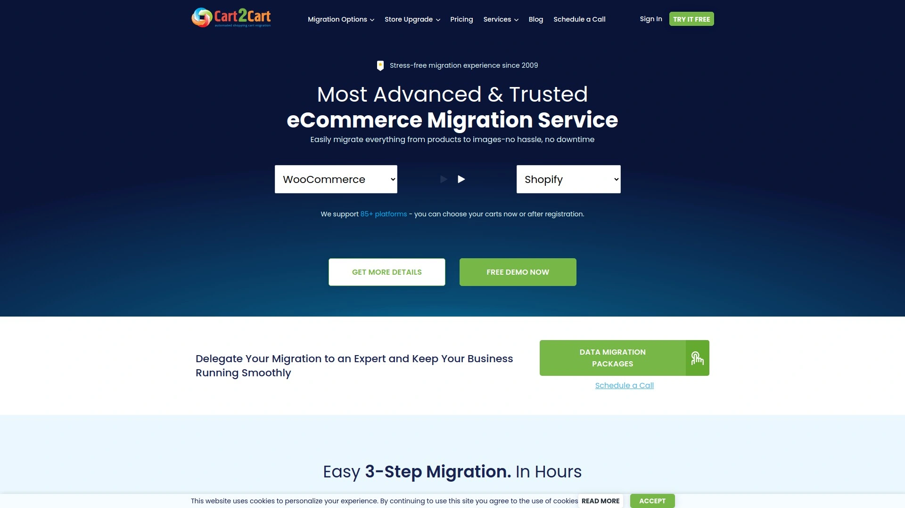
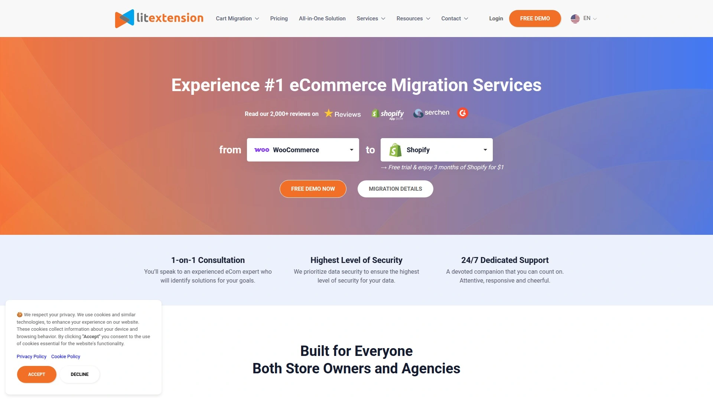
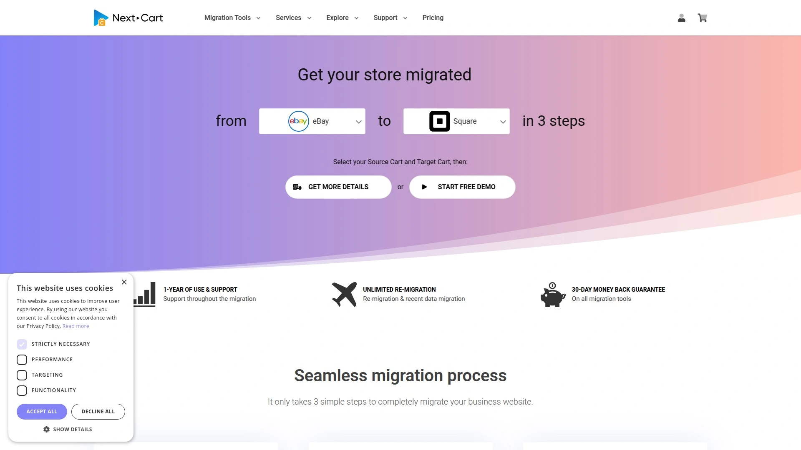
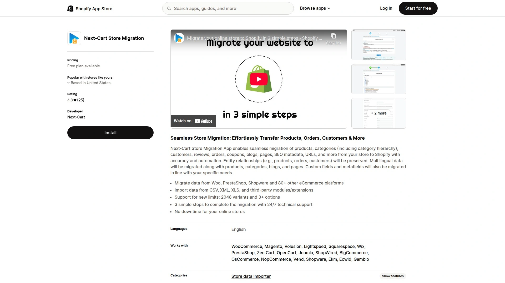
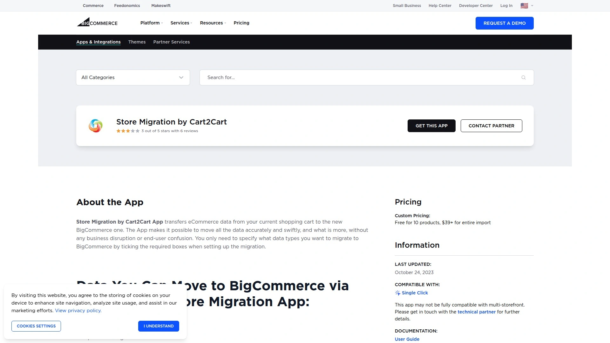

# No More Manual Data Transfer! Recommend 7 Automated Migration Game-Changers!

Moving your online store to a new platform while manually copying 15,000 products, 8,000 customers, and 20,000 order histories sounds like volunteering for digital torture. Traditional ecommerce migration means hiring developers for $5,000-15,000, enduring 2-4 weeks of downtime watching revenue evaporate, and praying nothing breaks when you flip the switch. Automated shopping cart migration services eliminate this nightmare by transferring everything—products, customers, orders, reviews, SEO URLs—in hours instead of weeks, with zero downtime keeping your store running while data moves behind the scenes. Whether you're escaping an outdated platform or consolidating multiple stores, these tools handle the tedious work of matching data fields, preserving relationships, and testing accuracy before touching your live site.

## **[Cart2Cart](https://shopping-cart-migration.com)**

Industry veteran supporting 85+ platforms with fully automated three-step migration and 16 years proven track record.

Cart2Cart operates as the most established automated migration service, processing over 100,000 store migrations since 2009. The platform supports virtually every ecommerce platform including Shopify, WooCommerce, BigCommerce, Magento, PrestaShop, Wix, OpenCart, Volusion, and 75+ others. This universal compatibility means you can migrate from any source to any destination without worrying whether your specific platform combination is supported.

The three-step process eliminates technical complexity completely. Step one connects your source and target stores by entering URLs and selecting platforms from dropdown menus. Step two lets you choose which data entities to transfer—products, customers, orders, categories, manufacturers, coupons, reviews, CMS pages, blogs—with checkboxes requiring zero coding knowledge. Step three runs a free demo migration moving limited data so you see exactly how your store will look post-migration before paying anything.

Zero downtime during migration keeps your source store fully operational throughout the entire process. Customers continue browsing, ordering, and checking out without interruptions or error messages. The migration happens entirely on secure backend servers, transferring data while your storefront remains live. This architecture prevents the revenue loss and customer frustration that plagued traditional migrations requiring temporary site shutdowns.

SEO preservation protects hard-earned search rankings through automatic 301 redirect creation. When product URLs change between platforms, Cart2Cart generates redirects ensuring old Google-indexed links send visitors to correct new pages instead of 404 errors. Meta titles, descriptions, and URL structures transfer intact, maintaining organic visibility you've built over years.

The pricing model charges only for entities migrated rather than flat fees. A store with 1,500 products typically costs around $99, with pricing scaling based on volume. This pay-per-record approach means small stores pay small amounts while large enterprises pay proportionally more for moving millions of records. Free demo migrations with 10 products, 10 customers, and 10 orders let you validate accuracy before committing funds.

24/7 technical support via live chat assists throughout migrations. The team helps troubleshoot connection issues, advises on additional options, and answers questions about data mapping. Custom migration services handle complex scenarios requiring manual intervention, though most migrations complete fully automated without human assistance.

## **[LitExtension](https://litextension.com)**

Expert-led migration service supporting 140+ platforms with all-in-one packages and dedicated migration specialists.

LitExtension distinguishes itself through human expertise backing the automated technology. While the platform provides self-service automated migration similar to competitors, its All-in-One Migration Service adds dedicated specialists handling your entire migration from planning through post-launch validation. This hybrid approach combines automation efficiency with expert oversight ensuring complex migrations succeed flawlessly.

The automated migration package handles standard transfers across 140+ supported platforms including major systems like Shopify, Magento, WooCommerce, BigCommerce, PrestaShop, and specialized platforms like Etsy, eBay, and Amazon. The tool migrates products with variants, categories with hierarchies, customers with passwords, orders with complete details, reviews, coupons, CMS pages, blogs, and SEO metadata automatically.

Free demo migrations include unlimited entities (not just 10 like some competitors), letting you test with realistic data volumes matching your actual store size. This comprehensive testing reveals potential issues before full migration, allowing adjustments ensuring everything transfers correctly. The demo includes migrations from file formats like Excel and CSV, useful when moving from custom platforms lacking direct API connections.

The All-in-One Migration Service provides end-to-end expert handling. LitExtension specialists analyze your source and target platforms, recommend optimal migration strategies, configure the migration setup, perform the data transfer, test results thoroughly, and provide post-migration support addressing any issues. This premium service suits merchants wanting guaranteed results without investing personal time learning migration intricacies.

Security emphasis includes data encryption during transfer, secure server infrastructure, and strict confidentiality policies. The platform holds certifications demonstrating compliance with data protection standards. Source store passwords remain encrypted, never stored in plain text, protecting customer accounts throughout the process.

Pricing flexibility accommodates different budgets and needs. Automated migration starts free for stores under 100 products, 100 customers, and 100 orders—genuinely free with no hidden costs. Larger stores pay based on entity counts with transparent pricing calculators showing exact costs before starting. All-in-One Service pricing quotes customize based on migration complexity and specific requirements.

## **[Next-Cart](https://next-cart.com)**

Cost-effective migration tool with API-based syncing and one-year service warranty for budget-conscious merchants.

Next-Cart positions itself as the affordable alternative, delivering solid migration capabilities at lower price points than premium competitors. The platform supports 80+ ecommerce platforms and CMS systems plus file imports from CSV, XML, XLS, XLSX, and SQL databases. This broad compatibility covers most migration scenarios while maintaining competitive pricing.

API-based architecture enables real-time data syncing rather than one-time snapshots. After initial migration, Next-Cart can continue synchronizing new orders, customers, and product updates between platforms during transition periods. This ongoing sync proves valuable when running parallel stores temporarily or maintaining backup systems during phased migrations.

The technical team provides customization for unique migration needs. When standard mappings don't match your specific platform configuration or custom fields require special handling, Next-Cart developers modify the migration logic accommodating your requirements. This flexibility handles edge cases that break fully automated tools lacking human intervention options.

Entity relationship preservation maintains connections between products, orders, and customers. When Customer A placed Order B containing Product C, those relationships transfer intact to your new store. Order histories show correct customer names, products display accurate sales data, and customer accounts contain complete purchase records—critical for business intelligence and customer service continuity.

Multilingual and multi-currency support transfers international stores without losing translations or currency configurations. Product descriptions in English, Spanish, French, and German migrate to corresponding fields in target platforms. Prices display correctly in USD, EUR, GBP maintaining shopping experiences for global customer bases.

The one-year service warranty distinguishes Next-Cart from competitors. If migration issues surface within 12 months post-migration, Next-Cart provides support and corrections at no additional cost. This long-term commitment demonstrates confidence in migration quality and provides peace of mind for merchants concerned about hidden problems appearing later.

Pricing starts lower than major competitors while still delivering comprehensive migrations. The cost advantage appeals to small and medium businesses watching budgets carefully. Free demos validate capabilities before payment, and transparent pricing shows exact costs upfront without surprise fees during checkout.

## **[Matrixify](https://matrixify.app)**

Shopify-specialized bulk import/export powerhouse with advanced Excel-based data manipulation and unlimited variants.

Matrixify (formerly Excelify) focuses exclusively on Shopify, becoming the most sophisticated tool for merchants migrating to or already on Shopify. This specialization enables features impossible in universal migration tools trying to support dozens of platforms simultaneously. If Shopify is your destination, Matrixify provides unmatched power and flexibility.

Excel and Google Sheets integration makes data manipulation intuitive for non-technical users. Export your current store to spreadsheets, make bulk edits using familiar formulas and functions, then import the modified data to Shopify. This workflow empowers merchants to clean product data, update pricing, reorganize categories, and transform structures during migration rather than accepting whatever source platforms provide.

Support for Shopify's new limits handles stores with complex product variants. Traditional Shopify limitations of 100 variants per product and 3 options expand dramatically—Matrixify supports 2,048 variants and 3+ options when platforms allow. This accommodates industries like fashion and furniture where products vary across many dimensions (size, color, material, finish, configuration).

Metafield handling migrates custom fields from source platforms into Shopify's metafield system. Many platforms use proprietary field structures for storing specialized product data. Matrixify intelligently maps these custom fields into Shopify metafields, preserving information that basic migration tools lose. This protects months of data entry work adding product specifications, technical details, or marketing attributes.

Automatic redirect creation prevents SEO damage when URLs change. Matrixify generates comprehensive redirect maps ensuring every old product, collection, and page URL points to correct new Shopify addresses. This maintains link equity from backlinks and keeps search rankings intact despite platform migration.

Multi-location inventory synchronization handles complex fulfillment setups. Stores using multiple warehouses or retail locations migrate inventory quantities for each location separately, maintaining accurate stock levels across all fulfillment points. This prevents overselling or stock discrepancies disrupting operations post-migration.

The dry run feature previews imports without actually modifying your live store. You see exactly what will happen when full import runs, catching errors before they affect real data. This safety mechanism enables experimentation and refinement until migrations perform perfectly.

Pricing operates on a monthly subscription model ($69+) rather than per-migration fees. For merchants needing ongoing data management—regular imports, exports, updates—the subscription provides unlimited operations. Stores migrating once might prefer pay-per-use alternatives, but businesses continuously synchronizing data find subscription pricing economical.

## **[Next-Cart Store Migration for Shopify](https://apps.shopify.com/nextcart-store-migration)**

Native Shopify app integration with seamless storefront installation and multilingual data preservation.

The Next-Cart Shopify app delivers migration capabilities directly within Shopify's admin interface rather than requiring external websites. Install the app from Shopify App Store, configure migration parameters inside familiar Shopify settings, and launch transfers without leaving your store dashboard. This native integration streamlines workflows for Shopify merchants.

Support for 80+ source platforms covers WooCommerce, Magento, PrestaShop, BigCommerce, Wix, Squarespace, Volusion, OpenCart, Lightspeed, and dozens more. The app handles migrations from open-source platforms requiring file uploads, cloud-based systems using API credentials, and custom platforms via CSV/XML imports. This versatility eliminates the "we don't support your platform" roadblock.

Entity relationship preservation maintains critical connections between products, orders, and customers. Customer purchase histories remain intact showing which products they bought in which orders. Product sales data accurately reflects past performance. Customer segments and tags transfer appropriately. These relationships provide business intelligence and personalization capabilities rather than isolated data dumps.

Multilingual data migration preserves translations for international stores. Product names, descriptions, categories, and CMS content in multiple languages transfer to corresponding Shopify language fields. This saves countless hours re-translating content and maintains shopping experiences for non-English customers immediately post-migration.

Category hierarchy preservation maintains your organizational structure. Parent categories, subcategories, and nested classifications transfer with relationships intact. Products remain assigned to correct categories at appropriate hierarchy levels. This prevents the chaos of thousands of products dumped into flat category lists requiring manual reorganization.

SEO metadata and URL migration protect organic search visibility. Meta titles, descriptions, H1 tags, and custom URLs transfer from source platforms. The app creates redirects when URLs must change due to platform differences, maintaining link equity and search rankings you've built over years.

24/7 technical support assists during migrations via live chat and email. The team helps troubleshoot connection errors, advises on data mapping for unusual fields, and answers questions about best practices. This support proves valuable when migrating complex stores with customizations or non-standard configurations.

Pricing follows transparent per-entity models with free demos. Test migrations show exact results before payment. The Shopify app integrates seamlessly with Shopify billing, charges appearing on your regular Shopify invoices alongside other app subscriptions.

## **[Store Migration by Cart2Cart for BigCommerce](https://www.bigcommerce.com/apps/store-migration-by-cart2cart/)**

Official BigCommerce app offering verified compatibility and optimized data mapping for BigCommerce-specific features.

The Cart2Cart BigCommerce app provides official integration recognized and listed by BigCommerce, ensuring compatibility and ongoing updates matching BigCommerce platform evolution. When BigCommerce releases new features or changes data structures, the app updates accordingly maintaining seamless migrations without breakage.

Comprehensive data entity support migrates products with variants, product categories maintaining hierarchies, manufacturers, customers with complete profiles, orders including statuses and histories, coupons with conditions and restrictions, product reviews with ratings, blog posts with images and formatting, and CMS pages with custom content. This completeness eliminates the fragmented migrations requiring multiple tools or manual data entry filling gaps.

No business disruption during migration keeps your source store operational throughout the process. Customers browse products, place orders, and complete checkouts normally while data transfers occur behind scenes. The storefront never displays maintenance pages, error messages, or functionality losses that drive customers to competitors during multi-day traditional migrations.

Free demo migration moves 10 products, 10 customers, and 10 orders to your live BigCommerce store in under 30 minutes. This quick validation shows actual results on your real store rather than generic examples. You verify data accuracy, check formatting, confirm customizations work correctly, and gain confidence before launching full paid migration.

Additional migration options customize transfers matching specific needs. Options include migrating product options as variants, preserving customer passwords avoiding forced resets, clearing target store data before migration for clean starts, creating 301 redirects for SEO preservation, transferring product images and downloadable files, and mapping custom fields between platforms.

The automated framework requires zero coding skills. The interface guides you through connecting stores, selecting data entities with checkboxes, choosing additional options, and launching migrations with button clicks. No technical knowledge, developer hiring, or platform API documentation reading necessary—designed for merchant self-service.

Pricing starts at $39 for basic migrations, scaling based on store size and selected options. The transparent calculator shows exact costs before purchasing. Payment processes through BigCommerce App Store using your existing billing relationship, eliminating separate payment setups or external transaction concerns.

## **[LitExtension Store Migration for BigCommerce](https://www.bigcommerce.com/apps/litextension-store-migration/)**

BigCommerce-optimized app with 140+ platform support and premium all-in-one expert service option.

LitExtension's BigCommerce app combines self-service automation with optional expert services, accommodating both DIY merchants and those preferring hands-off professional handling. The app supports migrations from 140+ platforms including Shopify, Magento, WooCommerce, PrestaShop, Wix, Squarespace, and file imports from Excel and CSV when migrating from custom platforms.

Three migration service tiers accommodate different needs and budgets. Demo Migration runs completely free, testing how your data appears on BigCommerce with unlimited entities (unlike competitors limiting demos to 10-20 records). Full Migration uses the app to automatically import all data to BigCommerce with pricing based on entity counts and selected options. All-in-One Migration Service provides LitExtension experts performing the entire migration from analysis through testing, ensuring complex migrations succeed without merchant involvement.

SEO URL migration preserves search engine visibility by transferring custom URLs and creating redirects when necessary. Product, category, and page URLs maintain existing structures when possible or generate appropriate redirects when platform differences require URL changes. This protects organic traffic and rankings representing months or years of SEO investment.

301 redirect creation happens automatically for URLs that must change due to platform architecture differences. The redirects map old addresses to new locations, ensuring customers clicking bookmarks or following old links reach correct pages rather than 404 errors. Search engines follow redirects updating indexes while passing link equity to new URLs.

HTML stripping from category and product names removes formatting artifacts that appear as visible code in target platforms. Some source platforms embed HTML tags in product titles or category names. LitExtension detects and removes these tags during migration, ensuring clean text displays correctly without visible markup breaking design.

Clear data on target store option wipes BigCommerce clean before migration, useful when testing multiple migration configurations or starting fresh after unsatisfactory demo results. This prevents duplicate products, categories, or customers accumulating from multiple test runs cluttering your store.

Premium support includes free consultation calls discussing migration strategy, data mapping recommendations, and answering questions about your specific migration scenario. The support team provides migration result testing after completion, validating data accuracy and helping identify any issues requiring attention.

## FAQ

**How long does ecommerce migration typically take using automated tools?**

Automated migration services complete data transfers in 1-8 hours depending on store size and complexity, dramatically faster than manual migrations requiring 2-4 weeks. A typical store with 1,500 products, 5,000 customers, and 10,000 orders migrates in approximately 3-5 hours using tools like Cart2Cart or LitExtension. Very large stores with 50,000+ products might take 12-24 hours. Most platforms offer free demo migrations completing in 10-30 minutes, letting you gauge timing before full migration. The key advantage is zero downtime—your source store remains fully operational during the entire process, eliminating revenue loss that plagued traditional migrations requiring extended maintenance windows.

**Can automated migration tools preserve SEO rankings and customer passwords?**

Yes, leading migration services preserve SEO elements and customer passwords with proper configuration. Tools like Cart2Cart and LitExtension automatically transfer meta titles, descriptions, H1 tags, and custom URLs while creating 301 redirects when URLs must change between platforms. This maintains search rankings and prevents 404 errors from breaking backlinks. Customer password migration depends on platform compatibility—many services offer password transfer as an additional option, though some platforms use incompatible encryption requiring customer password resets post-migration. Always test SEO preservation during free demo migrations to verify your specific source-to-target combination handles SEO elements correctly.

**What happens if data doesn't migrate correctly or gets corrupted during transfer?**

Reputable migration services implement multiple safety mechanisms preventing data corruption. Free demo migrations transfer limited data to your live target store, letting you verify accuracy before paying for full migration. Most platforms don't delete or modify source store data—they copy information to target stores, leaving originals intact as backups. If issues occur during full migration, you can re-run migrations after adjusting configurations, with some services like Next-Cart offering one-year warranties covering post-migration problem resolution. The automated approach actually reduces corruption risk compared to manual transfers where human error frequently causes mistakes. Always maintain source store backups before migration and thoroughly test demo results before launching full transfers.

## Conclusion

Manual ecommerce platform migration wastes weeks of time, costs thousands in developer fees, and risks losing critical data in translation between systems while your store sits offline hemorrhaging revenue. Automated shopping cart migration services complete the same work in hours rather than weeks, transfer everything from products to passwords without downtime, and cost 90% less than traditional developer-led migrations. [Cart2Cart](https://shopping-cart-migration.com) delivers the most established solution with 16 years of proven success migrating over 100,000 stores across 85+ platforms, offering zero-downtime transfers, free unlimited demos, automatic SEO preservation, and transparent pricing starting around $99 for typical stores—making it ideal for merchants needing reliable migration backed by extensive platform support and 24/7 technical assistance throughout the process.
